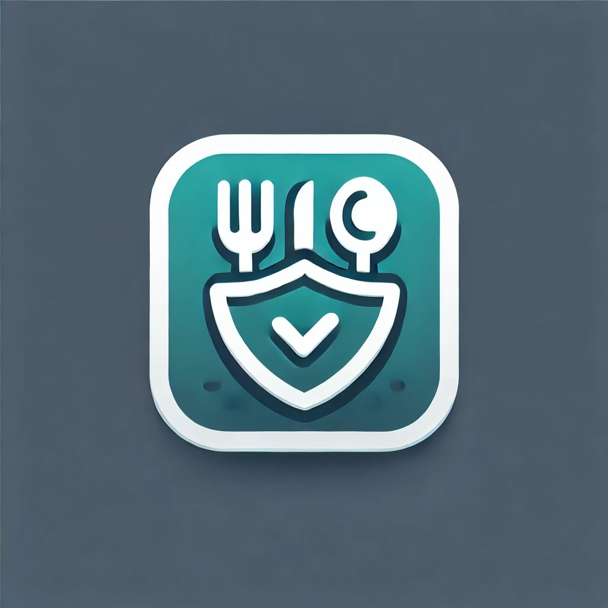

<!-- Improved compatibility of back to top link: See: https://github.com/othneildrew/Best-README-Template/pull/73 -->
<a name="readme-top"></a>

<!-- PROJECT LOGO -->
<br />
<div align="center">
  <a href="https://github.com/rossnelson/instrumentl-challenge">
    
  </a>

  <h3 align="center">SafeBite</h3>

  <p align="center">
    Ensuring Every Bite is Safe.
  </p>

  <p align="center">
    SafeBite is a restaurant inspection and food safety platform that provides
    insights into health inspections, violations, and compliance ratings. 
    By aggregating and analyzing inspection data, SafeBite helps diners make 
    informed choices and empowers restaurants to maintain the highest food safety standards.
  </p>
</div>

<!-- TABLE OF CONTENTS -->
<details>
  <summary>Table of Contents</summary>
  <ol>
    <li>
      <a href="#about-the-project">About The Project</a>
      <ul>
        <li><a href="#built-with">Built With</a></li>
      </ul>
    </li>
    <li>
      <a href="#getting-started">Getting Started</a>
      <ul>
        <li><a href="#prerequisites">Prerequisites</a></li>
        <li><a href="#installation">Installation</a></li>
      </ul>
    </li>
    <li>
      <a href="#usage">Usage</a>
      <ul>
        <li><a href="#import-the-sample-data">Import Sample Data</a></li>
        <li><a href="#api-endpoints">API Endpoints</a></li>
        <li><a href="#convenience-scripts">Convenience Scripts</a></li>
      </ul>
    </li>
    <li><a href="#roadmap">Roadmap</a></li>
  </ol>
</details>

<!-- ABOUT THE PROJECT -->
## About The Project

This project is organized into two primary features:
* A data import service
* A REST API for data access

<p align="right">(<a href="#readme-top">back to top</a>)</p>

### Built With

For this challenge, locally accessible services and tools were selected:

[![Postgresql][Postgresql]][Postgresql-url]  
[![Rails 7.2][Rails72]][Rails72-url]  
[![Ruby][Ruby]][Ruby-url]  
[![Dry-rb][Dry-rb]][Dry-rb-url]  
[![Activerecord][Activerecord]][Activerecord-url]  
[![ActiveJob][ActiveJob]][ActiveJob-url]  

<p align="right">(<a href="#readme-top">back to top</a>)</p>

<!-- GETTING STARTED -->
## Getting Started

Ensure the prerequisite tools are installed, then review the Installation and
Usage sections below.

### Prerequisites

* Ruby version 3.1.6 or greater
* Docker Desktop and Compose

### Installation

Once the prerequisites have been met, at the root of the project, run:

```sh
make -j
```

This will:
- Start the Rails application.
- Start the Docker Compose service.
- Tail the development logs.

The Rails application will be available at `localhost:3000`, and PostgreSQL will
be available at `localhost:5432`. 

<p align="right">(<a href="#readme-top">back to top</a>)</p>

<!-- USAGE EXAMPLES -->
## Usage

### Import the sample data

Create a directory for the sample data:

```sh
mkdir -p tmp/ingest
```

Then copy the sample data to the ingest directory.

Once data is i place, run:

```sh
make ingest
```

This will execute the `ingest:files` rake task, which calls the
`Ingestion::QueueFilesService`. This service will loop over the files in the
configured `ingest_dir` and pass each file path to the
`Ingestion::ProcessFileService`. The `Ingestion::ProcessFileService` will stream
the CSV rows to the `Ingestion::ProcessInspectionService`, one at a time, for
validation and database insertion.

### API Endpoints

All endpoints are currently unauthenticated. In a production environment, we
would expect some form of authentication.

- `GET /locations` - List locations.
- `GET /locations/:id/inspections` - List all inspections for a location.
- `GET /metrics` - Return total counts for each imported object.

Since metrics are aggregates, they are not paginated. However, the resource endpoints
use Kaminari for pagination. Add `page` and `size` query parameters to control
pagination. By default, we only render the first 25 items. 

You can also use full-text search on locations by passing the `search`
parameter. For example:

```sh
GET /locations?search=Tiramisu
```

This will return all locations with "Tiramisu" in the name.

### Executing Tests

From the root of the project, run:

```sh
make test
```

This will:
1. Wait for the PostgreSQL database to become accessible.
2. Create and migrate the test database.
3. Lint the codebase using `rubocop`.
4. Execute unit tests using `rspec`.

<p align="right">(<a href="#readme-top">back to top</a>)</p>

<!-- ROADMAP -->
## Roadmap

- [ ] Improve Inspection Validation and Value tpye coercion.
- [ ] Properly configured Active Job backend.
- [ ] Add coverage with unit tests.
- [ ] Ranked Risk Categories and Violation Codes
- [ ] Add sorting to endpoints.
- [ ] Clean the raw data prior to insertion:
    - trim whitespace
    - normalize address fields
    - normalize phone numbers
    - normalize inspection dates
- [ ] Add additional aggregates:
    - Top `n` violations
    - Top `n` locations with violations
    - Violations by location over time
    - Violation severity map
- [ ] Authentication

### Production-Readiness Plan:

Ingestion Flow:


Platform Architecture:


<p align="right">(<a href="#readme-top">back to top</a>)</p>

<!-- CONTACT -->
## Contact

Ross Nelson - ross@simiancreative.com

Project Link: [https://github.com/rossnelson/instrumentl-challenge](https://github.com/rossnelson/instrumentl-challenge)

<p align="right">(<a href="#readme-top">back to top</a>)</p>


<!-- MARKDOWN LINKS & IMAGES -->
<!-- https://www.markdownguide.org/basic-syntax/#reference-style-links -->
[Postgresql]: https://img.shields.io/badge/PostgreSQL-4169E1?style=for-the-badge&logo=postgresql&logoColor=white
[Postgresql-url]: https://www.postgresql.org/

[Rails72]: https://img.shields.io/badge/Rails_7.2-D30001?style=for-the-badge&logo=rubyonrails&logoColor=white
[Rails72-url]: https://rubyonrails.org/

[Ruby]: https://img.shields.io/badge/Ruby-CC342D?style=for-the-badge&logo=ruby&logoColor=white
[Ruby-url]: https://www.ruby-lang.org

[Dry-rb]: https://img.shields.io/badge/Dryrb-306d7d?style=for-the-badge&logo=rubygems&logoColor=white
[Dry-rb-url]: https://dry-rb.org

[Activerecord]: https://img.shields.io/badge/Activerecord-e9573f?style=for-the-badge&logo=rubygems&logoColor=white
[Activerecord-url]: https://rubygems.org/gems/activerecord/versions/5.0.0.1

[ActiveJob]: https://img.shields.io/badge/Activejob-5B3F8C?style=for-the-badge&logo=rubygems&logoColor=white
[ActiveJob-url]: https://guides.rubyonrails.org/active_job_basics.html
